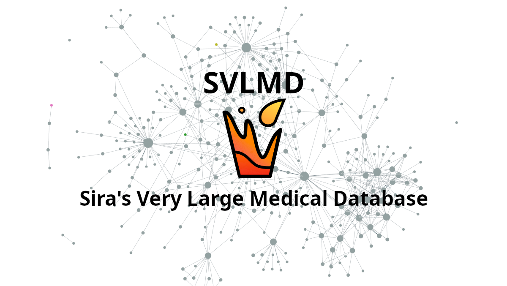

exclude-from-graph-view:: true

- ## What's SVLMD
	- **[[Sira's Very Large Medical Database]]** (SVLMD) is a **community-maintained**, expert-reviewed, **non-hierachical** medical education database. The information prioritizes demographics, geography, and socioeconomy in the context of **Thailand**.
	- 
- ## [[LICENSE]]
	- **[[SVLMD]]** is licensed under **CC BY-NC 4.0** ([Creative Commons Attribution-NonCommercial 4.0 International License](https://creativecommons.org/licenses/by-nc/4.0/)). All contributors agree to publish under this license.
- ## [[Changelog]]
- ## [[TODO]]
- ## [[Authors]]