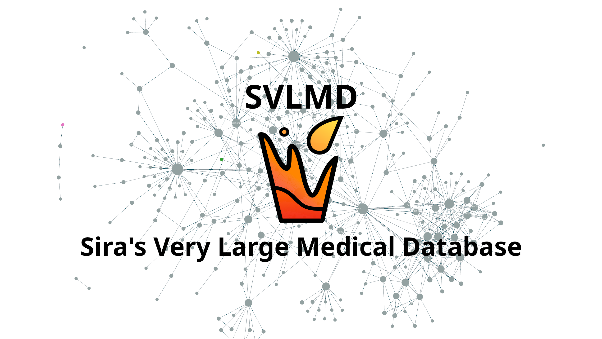

icon:: ℹ️
exclude-from-graph-view:: true

- # What's SVLMD
	- **[[Sira's Very Large Medical Database]]** (SVLMD) is a **community-maintained**, expert-reviewed, **non-hierachical** medical education database. The information prioritizes demographics, geography, and socioeconomy in the context of **Thailand**.
	- 
	- The logo depicts a glass filling up with water, drop by drop, signifying the development of this project, which is gradual and accummulative. This glass will never be full, reflecting the nature of academia.
- # [[LICENSE]]
	- **[[SVLMD]]** is licensed under **CC BY-NC 4.0** ([Creative Commons Attribution-NonCommercial 4.0 International License](https://creativecommons.org/licenses/by-nc/4.0/)). All contributors agree to publish under this license.
- # [[Version]]
	- {{embed ((68485ed1-44f1-410e-8439-089c43b040a8))}}
- # [[Changelog]]
- # [[TODO]]