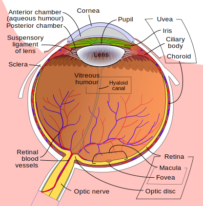

icon:: 👁️
alias::
parent:: [[Eye]] 
author:: [[Sira Pornsiriprasert]] 
reviewer::
review-date::
tags:: [[Anatomy]]

- The [[Eye]] is the organ of sight situated in the [[Orbital Cavity]].
- 
  Modified from Rhcastilhos. And Jmarchn. - Schematic_diagram_of_the_human_eye_with_English_annotations.svg, CC BY-SA 3.0, https://commons.wikimedia.org/w/index.php?curid=1597930
- # Location of the Eyeball
	- About 18 mm from the [[Optic Canal]] [(Bowling, 2016)]([[References/bowlingKanskisClinicalOphthalmology2016]]).
	- The [[Anteroposterior]] distance from the corneal apex to:
		- [[Superior Orbital Margin]]: 5.8 mm
		- [[Medial Orbital Margin]]: 5.8 mm
		- [[Inferior Orbital Margin]]: 12.0 mm
		- [[Lateral Orbital Margin]]: 17.9 mm
		- via [(Shin, 2017)]([[References/shinThreedimensionalTopographicRelationships2017]])
	- Distance on horizontal plane from the lateral orbital rim to the corneal apex ([[EV]]) in Han Chinese: 15.7 mm [(Wu, 2015)]([[References/wuNormalValuesHertel2015]]).
- # Structures
	- ## [[Eyeball]]
	- ## [[Orbit]]
- # Eye in Numbers
	- Main reference: [(American Academy of Ophthalmology, 2016)]([[References/americanacademyofophthalmologyFundamentalsPrinciplesOphthalmology2016]])
	- ## Structures
		- id:: 68482978-ec99-4874-b02b-fbad9efbae32
		  | **Structure**     | **Dimensions (mm)**   |    **Volume**      |
		  |--|--|--|
		  | [[Orbit]]  | 35 wide x 40–45 tall x 40–45 deep; 25 between the medial walls                                                                 | 30 cm³ |
		  | [[Eyeball]]        | Transverse diameter 24, axial length 23–25  Posterior curvature radius -13.4 †| 6.5–7.0 cm³ |
		  | [[Cornea]]      | 11.5 wide x 12.0–12.5 tall  Thickness: 0.540 centrally, 0.7–1.0 near limbus   Curvature radii: anterior 7.8, posterior 6.5 † |                                |
		  | [[Lens]]      | Transverse diameter 9–10  Thickness: 3 at birth to 6 at age 80, anterior capsule 0.155, posterior capsule 0.028  Curvature radii: anterior 10.2, posterior -6 † | 230.4 mm³ *                    |
		  | [[Optic Nerve]]           | Total length 40–51, intraocular 1.0 long, intraorbital 25–30 long| -                              |
		- † Reference: [(Artal, 2014)]([[References/artalOpticsEyeIts2014]])
		- * Reference: [(Waring, 2021)]([[References/waringCorrelationIntraoperativeOptical2021]])
	- ## Fluid and Spaces
		- | **Structure**         | **Dimensions (mm)**                                                                                              | **Volume**                     |
		  | [[Anterior Chamber]]       | 3 deep centrally                                                                                                 | 200 mm³                        |
		  | [[Posterior Chamber]]     | -                                                                                                                | 60 mm³                         |
		  | [[Aqueous Humor]]         | -                                                                                                                | 260 mm³                        |
		  | [[Postremal Chamber]]     | 16.6 deep centrally †                                                                                            | 5–6 cm³                        |
		  | [[Vitreous Humor]]        | -                                                                                                                | 4 cm³                          |
		- † Reference: [(Artal, 2014)]([[References/artalOpticsEyeIts2014]])
	- ## [[Extraocular Muscles]]
		- | **Structure**         | **Dimensions (mm)**              | 
		  | [[Superior Rectus]]      | 41.8 long x 10.6 wide               | 
		  | [[Inferior Rectus]]        | 40 long x 9.8 wide                   | 
		  | [[Medial Rectus]]         | 40.8 long x 10.3 wide              | 
		  | [[Lateral Rectus]]         | 40.8 long x 9.2 wide                | 
		  | [[Superior Oblique]]     | 40 long x 10.8 wide                 |
		  | [[Inferior Oblique]]      | 37 long x 9.6 wide                     |
	-