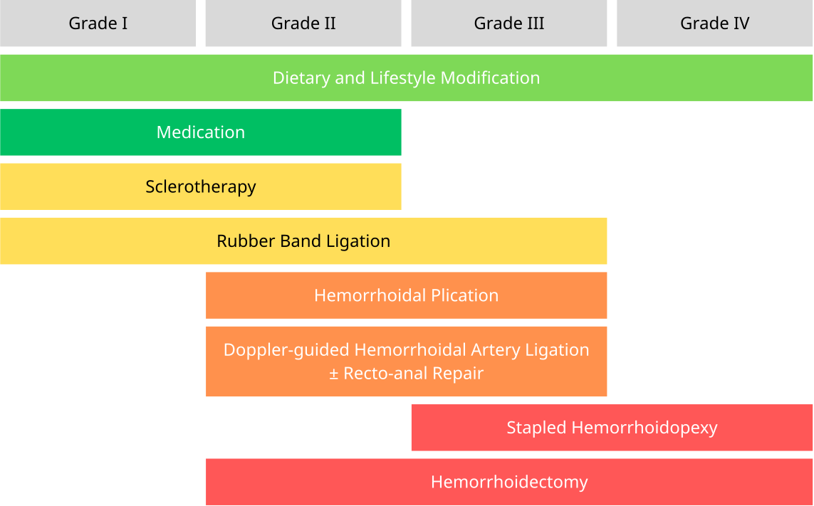

icon:: 
icon::
alias::
parent::
author:: [[Sira Pornsiriprasert]] 
reviewer::
review-date::
tags:: [[Disease]]

- **Hemorrhoids** are enlargement and downward displacement of the **[[Anal Cushion]]**.
- Main reference: [(Lohsiriwat, 2013)]([[References/lohsiriwatApproachHemorrhoids2013]]).
- # Pathophysiology
	- Degenerative change of supportive tissue within the anal cushions
	- Vascular hyperplasia
	- Hyperperfusion of [[Hemorrhoidal Plexus]]
- # Risk Factors
	- [[Constipation]]
	- [[Overweight]]
	- Older age
	- Female sex
	- Low fiber diet
	- Sedentary
	- Smoking
	- Pregnancy
- # Clinical Presentation
	- Painless [[Rectal Bleeding]] with fresh blood during bowel movement
	- Prolapsing anal tissue
- # Diagnosis
	- [[Digital Rectal Examination]] + [[Proctoscopy]]
- # Classification & Grading
	- ## [[Internal Hemorrhoid]]
		- **Originates above the [[Dentate Line]]** and covered by anal mucosa
		- Use [[Goligher Classification]] for grading
			- **Grade I:** Non-prolapsing
			- **Grade II:** Prolapsing on straining but reduce spontaneously
			- **Grade III:** Prolapsing requiring manual reduction
			- **Grade IV:** Non-reducible or acutely thrombosed, incarcerated hemorrhoids
	- ## [[External Hemorrhoid]]
		- **Originates below the [[Dentate Line]]** and covered by [[Anoderm]]
- # Management
	- The management of hemorrhoids depends on grading.
	- 
	- Modified via [(Lohsiriwat, 2013)]([[References/lohsiriwatApproachHemorrhoids2013]]).
	- ## Lifestyle Modification
		- High fiber, low fat diet ± fiber supplements ([[Mucilin]], [[Fybogel]])
		- Increase water intake
		- Regular exercise
		- Do not strain on the toilet and do not read on toilet
		- Avoid prolonged sitting
	- ## Medications
		- **[[Daflon]]** (flavonoid)
		- Proctocedyl
		- Fiber supplement
		- [[NSAID]] if pain or thrombosed
		- [[Metronidazole]] if thrombosed
	- ## [[Rubber Band Ligation]]
		- Place the rubber band is at the base of the hemorrhoid bundle, or over the bleeding site
		- Avoid placing the rubber band too close to the [[Dentate Line]] to mitigate pain
	- ## [[Hemorrhoidectomy]]
		- ### Complications
			- Pain
			- Bleeding
			- Stricture