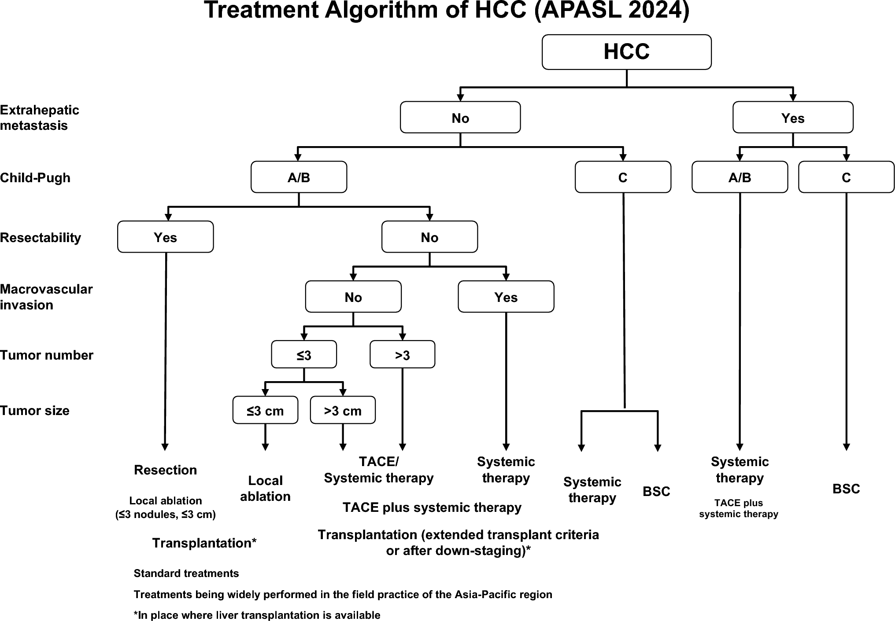

icon:: CA
alias:: HCC
parent:: [[Liver Cancer]]
author:: [[Sira Pornsiriprasert]] 
reviewer::
review-date::
tags:: [[Disease]], [[Cancer]]

- **Hepatocellular carcinoma** (HCC) is the most common primary [[Liver Cancer]] and the fifth most common [[Malignancy]] worldwide [(Brunicardi, 2018)]([[References/brunicardiSchwartzsPrinciplesSurgery2018]]).
- Its clinical presentation is highly variable. Patients may be asymptomatic, especially in early stages, or present with a range of symptoms related to liver dysfunction or tumor growth.
- Early detection is increasing due to improved screening and imaging.
- # Risk Factors in Thailand [(Chitapanarux, 2015)]([[References/chitapanaruxRiskFactorsDevelopment2015]]) #card
	- Chronic [[HBV]] infection
	- [[HCV]] infection
	- [[Liver Cirrhosis]]
	- [[Alcohol Consumption]]
	- [[Diabetes]]
	- [[Smoking]]
	- [[Aflatoxin B1]] exposure: peanuts, corn, grains
- # Clinical Presentation [(Bisceglie, 2002)]([[References/bisceglieEpidemiologyClinicalPresentation2002]])
	- **Asymptomatic:** Early-stage [[HCC]], diagnosed through screening
	- [[RUQ]] or generalized **[[Abdominal Pain]]**
	- **Liver dysfunctions:** [[Jaundice]], [[Ascites]], [[Hepatic Encephalopathy]], [[Variceal Bleeding]]
	- Systemic symptoms: [[Weight Loss]], [[Lethargy]], [[Malaise]]
- # Tumor Staging
	- See the **[[Barcelona Clinic Liver Cancer]]** guideline
- # Complications
	- ## [[Ruptured HCC]]
- # Diagnosis
	- The investigation and diagnosis of [[Hepatocellular Carcinoma]] (HCC) rely on a combination of surveillance, imaging, and laboratory tests, with a focus on early detection in high-risk individuals [(Yang, 2020)]([[References/yangNewAdvancesDiagnosis2020]]).
	- ## Surveillance and Initial Assessment
		- **Target Population:** Patients with [[Cirrhosis]] or chronic hepatitis B are recommended to undergo regular surveillance due to their high risk for [[HCC]].
		- **Surveillance Tools:** Biannual liver [[Ultrasonography]] is the standard method, often combined with serum [[AFP]] testing, though AFP alone is not sufficiently sensitive or specific.
	- ## Diagnostic Imaging #card
		- **First-line:** Multiphasic [[Contrast CT]], [[Magnetic Resonance Imaging]] (MRI)
		- **Characteristics:** **arterial phase hyperenhancement**, rapid washout in portal venous, or delayed phase washout.
			- [[HCC]] can be **diagnosed without biopsy unless atypical**.
	- ## Histopathology
		- **[[Liver Biopsy]]:** Reserved for cases where imaging is inconclusive or atypical.
- # Management
	- 
	- Diagram via [(Lau, 2024)]([[References/lauAPASLClinicalPractice2024]]).
	- ## Curative Treatments (Early-Stage HCC) [(Brown, 2023)]([[References/brownManagementHepatocellularCarcinoma2023]]) #card
		- **Surgical resection:** preferred for patients with good liver function and limited disease.
		- **[[Liver Transplantation]]**
		- **[[Ablation Therapy]]:** Alternative when surgery is not possible
	- ## Locoregional Therapies (Intermediate-Stage HCC) [(Lencioni, 2010)]([[References/lencioniLocoregionalTreatmentHepatocellular2010]]) #card
		- **[[Transarterial Chemoembolization]] (TACE):** Delivers chemotherapy directly to the tumor via its blood supply.
			- Standard for patients with larger or multifocal tumors not amenable to curative treatment
		- **[[Radioembolization]]:** Uses radioactive particles to target tumors when TACE is not suitable.
	- ## Systemic Therapies (Advanced-Stage HCC) [(Forner, 2019)]([[References/fornerControversiesManagementHepatocellular2019]])
		- **Targeted Therapies:** [[Sorafenib]], [[Lenvatinib]]
		- **[[Immunotherapy]]**