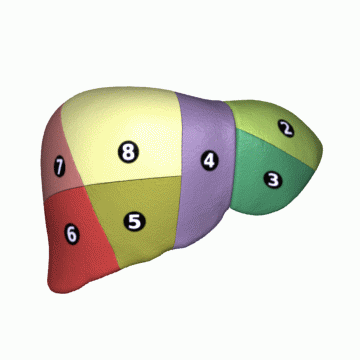

- alias::
  parent::
author:: [[Sira Pornsiriprasert]] 
reviewer::
review-date::

- ## Anatomy
	- ### Surgical Anatomy
		- Liver can be divided into **8 segments** 
		   using Couinaud classification system.
		- Segment 4 can be divided into **4a** (upper) and **4b** (lower).
		- {:height 368, :width 360}
