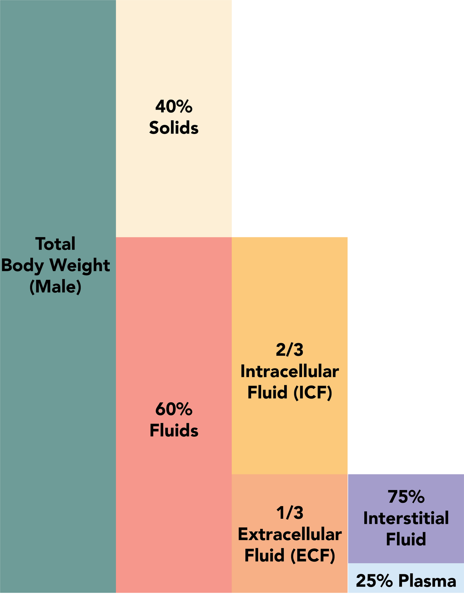

icon:: 💧
alias::
parent::
author:: [[Sira Pornsiriprasert]] 
reviewer::
review-date::
tags::

- Water accounts for about 60% of body weight in men and about 50% in women and elderly.
- Male body holds more water than female and elderly since [[Muscles]] hold more water than [[Fat]].
- # Compartments [(Costanzo, 2021)]([[References/costanzoCostanzoPhysiology2021]])
	- ## [[Intracellular Fluid]] (2/3)
		- Rich in [[Potassium]], [[Magnesium]], [[Protein]], and [[Organic Phosphate]]
	- ## [[Extracellular Fluid]] (1/3)
		- ### [[Plasma]] (25%)
		- ### [[Interstitial Fluid]] (75%)
	- ## [[Transcellular Fluid]]
		- [[CSF]], pleural, peritoneal, and digestive fluids
	- Diagram:
	  collapsed:: true
		- {:height 1004, :width 778}
		- By Alan Sved and David Walsh - Own work, CC BY-SA 4.0, https://commons.wikimedia.org/w/index.php?curid=81541888
- # Compartments in Detail [(Miller, 2015)]([[References/millerMillersAnesthesia2015]])
	- ## [[Intracellular Fluid]] (55%)
	- ## [[Extracellular Fluid]] (45%)
		- ### Functional [[ECF]] (27.5%)
			- #### Intravascular (7.5%)
				- [[Plasma]] (5.5%)
				- Sub-glycocalyceal (2%)
			- #### [[Interstitial Fluid]]
		- ### Sequestered (17.5%)
			- [[Bone]] and [[Dense Connective Tissue]] (15%)
			- [[Transcellular Fluid]] (2.5%)